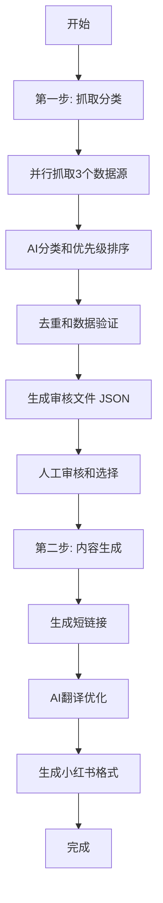

# 🎯 Bay Area Events Scraper

一个智能化的湾区活动抓取器，专为小红书发布优化。采用AI驱动的两步式工作流：先抓取分类，再人工审核生成内容。

## ✨ 功能特点

- 🕷️ **多源抓取**: Eventbrite, SF Station, Funcheap 三大平台
- 🤖 **AI智能分类**: 自动识别活动类型和优先级排序（支持 OpenAI, Gemini, Claude, Mistral）
- 👁️ **人工审核**: 生成候选列表供手动选择，确保内容质量
- 🔗 **智能短链**: 仅为选中活动生成 Short.io 短链接，支持自动重试
- 🌐 **AI翻译优化**: 专业的中文内容翻译和小红书格式适配
- 📅 **精准时间过滤**: 只抓取下周（周一到周日）的活动
- 🔄 **智能去重**: 统一URL和内容特征生成，支持数据库级去重
- 🎯 **活动描述**: 支持40+种特征提取 + 23类关键词智能兜底
- 💬 **自动种草**: 为每个活动自动添加吸引力话术
- ⏰ **GitHub Actions**: 每周三自动抓取，生成待审核文件

## 📁 项目结构

```
bay-area-events-scraper/
├── src/
│   ├── index.js                  # 主入口和命令路由
│   ├── scrape-events.js          # 第一步：抓取和分类
│   ├── generate-post.js          # 第二步：生成发布内容
│   ├── config.js                 # 全局配置
│   ├── scrapers/                 # 爬虫模块
│   │   ├── base-scraper.js       # 基础爬虫类
│   │   ├── eventbrite-scraper.js # Eventbrite爬虫
│   │   ├── sfstation-scraper.js  # SF Station爬虫
│   │   └── funcheap-weekend-scraper.js  # Funcheap爬虫
│   ├── utils/                    # 核心工具
│   │   ├── database.js           # SQLite数据库管理
│   │   ├── ai-classifier.js      # AI活动分类器
│   │   ├── manual-review.js      # 人工审核管理
│   │   └── url-shortener.js      # Short.io短链接
│   └── formatters/               # 内容生成
│       ├── translator.js         # AI翻译器
│       └── post-generator.js     # 小红书内容生成
├── data/                         # 数据存储
├── output/                       # 输出文件
├── .github/workflows/            # 自动化
└── validate.js                   # 环境验证
```

## 🔄 工作流程

### 两步式处理流程



## 安装与配置

### 1. 克隆项目

```bash
git clone <repository-url>
cd bay-area-events-scraper
```

### 2. 安装依赖

```bash
npm install
```

### 3. 配置环境变量

复制 `.env.example` 到 `.env` 并填入API密钥：

```bash
cp .env.example .env
```

编辑 `.env` 文件：

```env
# Short.io API (用于生成短链接)
SHORTIO_API_KEY=your_shortio_api_key_here

# AI提供商选择 (openai, gemini, claude, mistral)
AI_PROVIDER=openai

# AI API密钥 (至少配置一个)
OPENAI_API_KEY=your_openai_api_key_here
GEMINI_API_KEY=your_gemini_api_key_here
CLAUDE_API_KEY=your_claude_api_key_here
MISTRAL_API_KEY=your_mistral_api_key_here
```

### 4. 配置 GitHub Secrets (用于自动化)

在 GitHub 仓库设置中添加以下 Secrets：

- `SHORTIO_API_KEY`: Short.io API 密钥
- `AI_PROVIDER`: AI提供商选择 (openai, gemini, claude, mistral)
- 至少一个AI API密钥：
  - `OPENAI_API_KEY`: OpenAI API 密钥
  - `GEMINI_API_KEY`: Google Gemini API 密钥
  - `CLAUDE_API_KEY`: Anthropic Claude API 密钥
  - `MISTRAL_API_KEY`: Mistral AI API 密钥

## 🚀 使用方法

### 快速开始

```bash
# 1. 第一步：抓取活动并生成审核文件
npm run scrape
# 或指定AI提供商：
npm run scrape -- --ai-provider gemini
# 📝 输出：./output/review_YYYY-MM-DD_HHMM.json

# 3. 人工审核：编辑JSON文件
# 🔧 打开审核文件，将要发布的活动的 "selected" 改为 true
# 💡 提示：系统会提供40个候选活动供你选择

# 4. 第二步：生成最终发布内容（使用实际文件路径）
npm run generate-post "./output/review_2024-09-19_1430.json"
# 或指定AI提供商：
npm run generate-post "./output/review_2024-09-19_1430.json" --ai-provider claude
# 📱 输出：./output/weekly_events_YYYY-MM-DD_HHMM.txt

# 5. 复制内容到小红书发布！
```

### 🤖 AI提供商选择

系统支持四种AI服务，提供智能分类和翻译功能：

#### **OpenAI GPT** (默认)
- **模型**: gpt-3.5-turbo
- **优势**: 稳定可靠，中文支持好
- **API**: 需要 `OPENAI_API_KEY`

#### **Google Gemini**
- **模型**: gemini-2.0-flash-exp
- **优势**: 速度快，成本低，最新模型
- **API**: 需要 `GEMINI_API_KEY`

#### **Anthropic Claude**
- **模型**: claude-3-haiku-20240307
- **优势**: 理解能力强，输出质量高
- **API**: 需要 `CLAUDE_API_KEY`

#### **Mistral AI**
- **模型**: mistral-small-latest
- **优势**: 轻量级，响应快速
- **API**: 需要 `MISTRAL_API_KEY`

#### **选择方式**:
1. **环境变量**: 设置 `AI_PROVIDER=gemini`
2. **命令行参数**: `--ai-provider claude`
3. **自动故障转移**: 当前提供商失败时自动按顺序切换到备用提供商
   - 优先级: OpenAI → Gemini → Claude → Mistral

### 详细步骤

#### 第一步：抓取和分类

```bash
npm run scrape
```

这个命令会：
- 🕷️ 并行抓取 Eventbrite, SF Station, Funcheap （包括多个城市）
- 🤖 AI分类活动类型和设置优先级（自动选择可用的AI提供商）
- 🔄 智能去重处理
- 📄 生成审核文件 `output/review_YYYY-MM-DD_HHMM.json`

#### 第二步：人工审核和选择

**1. 找到审核文件**
抓取完成后，查看输出信息找到生成的审核文件路径：
```
✅ 审核文件已生成: ./output/review_2024-09-19_1430.json
```

**2. 编辑审核文件**
用任何文本编辑器打开JSON文件：
```bash
# 用你喜欢的编辑器打开
code ./output/review_2024-09-19_1430.json
# 或者
vim ./output/review_2024-09-19_1430.json
```

**3. 选择要发布的活动**
找到你想要发布的活动，将 `"selected"` 改为 `true`：

```json
{
  "id": 1,
  "selected": true,  // ← 改为 true 来选择此活动
  "title": "Ferry Building Farmers Market",
  "time_display": "Saturday 12/25 9:00 AM - 2:00 PM", 
  "location": "Ferry Building Marketplace",
  "price": "Free",
  "event_type": "market",
  "priority": 10,
  "chinese_relevant": true,
  "original_url": "https://...",
  // ... 其他字段
}
```

**4. 保存文件**
选择完成后保存JSON文件。

#### 第三步：生成最终发布内容

**运行生成命令**（使用你编辑的审核文件路径）：
```bash
npm run generate-post "./output/review_2024-09-19_1430.json"
```

**命令执行过程**：
1. 🔍 读取你的选择（只处理 selected: true 的活动）
2. 🔗 为选中活动生成 Short.io 短链接  
3. 🌐 AI翻译标题、描述到中文
4. 📱 生成小红书格式的发布内容
5. 📄 保存到 `./output/weekly_events_XXXX.txt`

**生成完成后**：
```
✅ 内容生成完成！
📄 发布内容: ./output/weekly_events_2024-09-19_1430.txt
📱 现在可以复制内容到小红书发布了！
```

**5. 复制到小红书**
打开生成的 `.txt` 文件，复制全部内容，粘贴到小红书发布框即可！

### GitHub Actions 自动化

项目配置了每周三 UTC 10:00（PST 2:00 AM）自动抓取：

1. **自动运行**: 每周三自动生成审核文件
2. **手动触发**: 在 Actions 页面手动运行
3. **下载文件**: 从 Artifacts 下载审核文件
4. **本地处理**: 审核后本地运行生成命令

## 📝 命令参考

### 主要命令

#### 1. 抓取活动（主要功能）
```bash
npm run scrape
```
- 从三个网站抓取活动（Eventbrite, SF Station, Funcheap）
- 包括湾区多个城市的活动
- AI分类和去重
- 生成 review JSON 文件在 `output/` 目录

#### 2. 使用不同AI提供商
```bash
npm run scrape -- --ai-provider openai   # 使用OpenAI (默认)
npm run scrape -- --ai-provider gemini   # 使用Google Gemini
npm run scrape -- --ai-provider claude   # 使用Claude
```

#### 3. 生成文章（在审核后）
```bash
npm run generate-post output/review_YYYY-MM-DD_HHMM.json
```
- 根据审核后的JSON生成最终文章
- 输出Markdown格式

#### 4. 查看帮助
```bash
npm run scrape -- --help
```

### 调试命令

#### 查看抓取错误
```bash
npm run scrape 2>&1 | grep -i "error\|invalid\|failed"
```

#### 查看特定网站的日志
```bash
npm run scrape 2>&1 | grep "Funcheap"
npm run scrape 2>&1 | grep "SFStation"
npm run scrape 2>&1 | grep "Eventbrite"
```

#### 查看时间处理日志
```bash
npm run scrape 2>&1 | grep -E "Invalid time|normalize|parseTime"
```

### 数据流程

```
npm run scrape
  ↓
1. 抓取 (Eventbrite 多城市 + SFStation + Funcheap) → ~300+ events
  ↓
2. 时间验证 + 地理位置过滤 (湾区范围) → ~150-200 events
  ↓
3. URL去重 + 内容特征去重 → ~80-100 events
  ↓
4. AI分类和优先级评分 → classified events
  ↓
5. 选择top候选 (40个) → final candidates
  ↓
6. 生成 review_*.json 文件
  ↓
手工审核 (修改 "selected": true)
  ↓
npm run generate-post review_*.json
  ↓
生成短链接 + 翻译 + 格式化
  ↓
生成小红书发布文本
```

## 📄 输出文件

### 第一步输出（抓取阶段）

```
output/
├── review_2024-09-19_1430.json    # 待审核的活动列表
└── data/events.db                 # SQLite数据库（历史记录）
```

**审核文件结构**：
```json
{
  "review_id": "review_2024-09-19_1430_abc",
  "target_week": "2024-09-23_to_2024-09-29", 
  "stats": {
    "total_candidates": 18,
    "by_type": {"market": 5, "festival": 3, "food": 4},
    "chinese_relevant": 7
  },
  "events": [
    {
      "id": 1,
      "selected": false,  // ← 改为 true 来选择
      "title": "Ferry Building Farmers Market",
      "time_display": "Saturday 12/25 9:00 AM - 2:00 PM",
      "location": "Ferry Building Marketplace",
      "price": "Free",
      "event_type": "market",
      "priority": 10,
      "original_url": "https://...",
      // ... 更多字段
    }
  ]
}
```

### 第二步输出（内容生成）

```
output/
├── weekly_events_2024-09-19_1430.txt        # 小红书发布内容
├── weekly_events_2024-09-19_1430_metadata.json  # 详细元数据
└── review_2024-09-19_1430.json              # 原审核文件
```

**小红书内容示例**：
```text
🎉 本周湾区精彩活动 9.23-9.29

📅 渡轮大厦农夫市集 (Ferry Building Farmers Market)
🕒 周六 12/25 上午9点-下午2点
📍 渡轮大厦市场 (Ferry Building Marketplace) 
💰 免费
📝 新鲜有机农产品好物
🔗 https://short.io/abc123

📅 硅谷科技音乐节 (Silicon Valley Tech Music Fest)
🕒 周日 12/26 下午3点-晚上10点
📍 山景城圆形剧场 (Mountain View Amphitheatre)
💰 $45-85 (约¥315-595)
📝 科技与音乐完美结合
🔗 https://short.io/def456

#湾区生活 #旧金山 #硅谷 #活动推荐 #周末去哪儿 #农夫市集
```

## ⚙️ 配置说明

### 核心配置 (`src/config.js`)

```javascript
// 事件源（当前3个）
eventSources: [
  { name: 'eventbrite', baseUrl: '...', priority: 1, additionalCities: [...] },
  { name: 'sfstation', baseUrl: '...', priority: 1 },
  { name: 'funcheap', baseUrl: '...', priority: 1 }
]

// 活动类型优先级
eventTypePriority: {
  market: 10,     // 市集 - 最高优先级
  fair: 10,       // 博览会
  festival: 10,   // 节庆
  free: 9,        // 免费活动
  art: 5,         // 艺术活动
  tech: 5,        // 科技活动
  food: 6,        // 美食活动
  music: 4,       // 音乐活动
  default: 3      // 其他
}

// 地理位置过滤 - 重点：SF、南湾、半岛
locations: {
  // 最高优先级 - SF、南湾核心、半岛核心
  primary: [
    'San Francisco', 'SF', 'SOMA', 'Mission', 'Castro',           // 旧金山
    'San Jose', 'Santa Clara', 'Sunnyvale', 'Mountain View',     // 南湾核心
    'Palo Alto', 'Cupertino',                                   
    'Redwood City', 'Menlo Park', 'San Mateo', 'Foster City'    // 半岛核心
  ],
  
  // 次要优先级 - 其他湾区城市
  secondary: [
    'Fremont', 'Milpitas', 'Campbell', 'Los Gatos',            // 南湾其他
    'Burlingame', 'San Carlos', 'Millbrae',                    // 半岛其他
    'Oakland', 'Berkeley', 'Alameda'                           // 东湾（较低优先级）
  ],
  
  keywords: ['Bay Area', 'Silicon Valley', 'Peninsula', 'South Bay']
}

// 抓取限制
scraping: {
  maxEventsPerSource: 100,         // 每个源最多抓取数量（支持多城市）
  totalCandidatesForReview: 40,    // 最终候选数量
  requestDelay: 1000               // 请求间隔（毫秒）
}
```

## 数据流程

1. **抓取阶段**: 从各个网站抓取活动数据
2. **验证阶段**: 检查活动的时间、地点、有效性
3. **去重阶段**: 统一生成URL+内容特征键，支持数据库级去重
4. **存储阶段**: 保存到 SQLite 数据库
5. **分类阶段**: AI分类和优先级排序
6. **格式化阶段**:
   - 翻译标题和描述到中文
   - 智能提取活动特征（40+种）
   - 为特征不足的活动智能兜底（23类关键词）
   - 自动添加种草话术
7. **短链接生成**: 支持自动重试，遇到路径冲突自动重新生成
8. **输出阶段**: 生成最终的小红书格式文本

## 🏗️ 核心设计特点 (Oct 2024)

项目采用了多项设计最佳实践：

### 1. 智能去重策略
- **URL优先**: 优先使用originalUrl去重
- **内容特征兜底**: title(标准化) + time(小时精度) + location(小写)
- **两层去重**: 数据库级UNIQUE约束 + 应用层哈希去重

### 2. AI Provider自动故障转移
- **顺序**: OpenAI → Gemini → Claude → Mistral
- **机制**: 迭代切换，避免递归风险
- **透明**: 用户不感知，自动选择可用提供商

### 3. 短链接生成智能处理
- **路径冲突**: 自动重试生成新路径
- **认证失败**: 降级使用原始URL
- **不阻塞**: 短链接失败不影响整体流程

### 4. 40+ 特征提取 + 23类关键词兜底
- **动态特征**: 节庆、地点、活动类型等40+特征
- **智能兜底**: 科技、瑜伽、喜剧、烹饪等23类关键词
- **自动种草**: 为每个活动添加吸引力话术

## 故障排除

### 常见问题

**1. 抓取失败**
- 检查目标网站是否更改了结构
- 验证网络连接和代理设置
- 查看 GitHub Actions 日志

**2. 翻译API错误**  
- 验证 OpenAI API 密钥
- 检查 API 配额是否充足
- 系统会自动降级到手动翻译

**3. 短链接生成失败**
- 验证 Short.io API 密钥  
- 检查API配额
- 系统会自动降级使用原始链接

### 日志查看

```bash
# 查看详细日志
DEBUG=* npm start

# 查看数据库内容
sqlite3 data/events.db ".tables"
sqlite3 data/events.db "SELECT * FROM events LIMIT 10;"
```

## 🏗️ 架构

项目采用**分层架构**和**编排模式**:

- **采集层**: 3个数据源并行爬取，统一规范化
- **处理层**: 去重、验证、分类、优先级评分
- **生成层**: 翻译、特征提取、小红书格式化
- **编排层**: 两个Orchestrator协调整个工作流

详细架构说明见 `ARCHITECTURE.md`

## 开发指南

### 添加新的事件源

1. 继承 `BaseScraper` 类
2. 实现 `scrape()` 方法
3. 在 `src/index.js` 中添加到 scrapers 数组

```javascript
const NewScraper = require('./scrapers/NewScraper');

this.scrapers = [
  new EventbriteScraper(),
  new SFStationScraper(),
  new NewScraper()  // 添加新的爬虫
];
```

### 自定义内容格式

修改 `src/config.js` 中的模板：

```javascript
content: {
  postTemplate: `你的自定义模板 {date_range}...`,
  eventTemplate: `你的事件模板...`
}
```

## 贡献

1. Fork 项目
2. 创建功能分支 (`git checkout -b feature/AmazingFeature`)
3. 提交更改 (`git commit -m 'Add some AmazingFeature'`)
4. 推送到分支 (`git push origin feature/AmazingFeature`)
5. 打开 Pull Request

## 许可证

MIT License

## 📚 相关文档

- **ARCHITECTURE.md**: 项目架构详解（分层设计、数据流、模块职责）
- **README.md**: 本文件（主要说明和快速开始）

## 📊 更新日志

### 2024年10月 - 核心架构优化
- ✅ 去重逻辑重构：统一key生成策略
- ✅ AI Provider切换优化：从递归改为迭代
- ✅ URL短链接重试优化：智能错误分类
- ✅ 活动描述生成大幅改进：
  - 删除6个特殊节日配置，改为40+通用特征
  - 添加23类关键词智能兜底
  - 实现自动种草话术
  - 覆盖面提升10倍

### 2024年9月 - 初始版本
- 🎯 基础爬虫框架
- 📄 JSON审核流程
- 🚀 GitHub Actions自动化

## 联系方式

如有问题或建议，请创建 Issue 或 Pull Request。